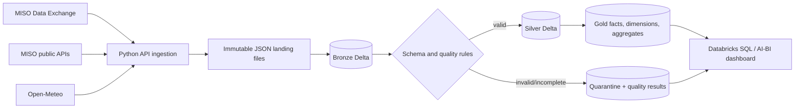

# Energy Market Analytics Lakehouse

**End-to-end Databricks lakehouse for historical and near-real-time energy-market analytics using PySpark, Delta Lake, SQL, MISO and weather APIs.**

This portfolio project ingests real MISO electricity-market data and Open-Meteo weather data into a reproducible Bronze/Silver/Gold lakehouse. It emphasizes incremental processing, traceability, data quality, dimensional modeling, and business-facing analytics. The included sample is a real, complete MISO market day and requires no private credentials.

## What is implemented

- Historical MISO actual-load and published-forecast ingestion with retry, pagination, checksums, and manifests.
- Public MISO near-real-time snapshot ingestion and Open-Meteo weather ingestion.
- Bronze append-only Delta tables with source and batch metadata.
- Silver PySpark transformations with explicit schemas, timestamp normalization, deduplication, quarantine, and complete-day validation.
- Gold facts, dimensions, demand/forecast aggregates, and queryable pipeline-quality results.
- Idempotent `MERGE` writes and queryable rule outcomes for safe restarts and backfills.
- Databricks notebooks, workflow configuration, dashboard SQL, unit tests, data dictionary, and architecture documentation.

The repository accurately describes a **historical and near-real-time pipeline**. It is not a streaming system.

## Architecture



See [docs/architecture.md](docs/architecture.md) for design decisions and recovery behavior.

## Repository map

```text
databricks/       Databricks notebooks and Asset Bundle workflow
docs/             Architecture, sources, dictionary, dashboard, limitations
sample_data/      Small non-sensitive real source extracts
sql/              Dashboard-ready analytical queries
src/              Ingestion, schemas, quality rules, and PySpark pipelines
tests/            Fast unit tests plus optional Spark integration tests
```

## Quick start in Databricks Free Edition

1. Create a Databricks Free Edition workspace and a Git folder from this repository.
2. Open `databricks/notebooks/00_setup.py` and run it on serverless compute. It installs the project and creates the catalog/schema configured by widgets.
3. Run `01_bronze.py`, `02_silver.py`, and `03_gold.py` in order. Their defaults load the verified complete day in `sample_data/` and use the `energy_market` catalog with `bronze`, `silver`, `gold`, and `ops` schemas.
4. Run `04_validate.py`; it fails if blocking quality rules fail.
5. Create an AI/BI dashboard using the queries in `sql/dashboard_queries.sql`; the proposed layout is in [docs/dashboard.md](docs/dashboard.md).

Free Edition capabilities can vary by workspace. If custom catalogs are unavailable, set the catalog widget to `workspace`.

## Local development

Requires Python 3.11–3.13 and Java 17 for local Spark. Python 3.14 is not currently targeted by the pinned Spark dependency.

```powershell
py -3.12 -m venv .venv
.venv\Scripts\Activate.ps1
python -m pip install -e ".[dev]"
pytest
```

The pure-Python tests do not require API credentials. Tests marked `spark` require Java and PySpark.

Continuous integration runs linting and the complete test suite on Python 3.12. The current workstation verification can skip the Spark integration test when PySpark/Java are not installed; that skip is reported rather than hidden.

## Ingestion

Copy `.env.example` to `.env` only on your machine. Never commit it.

```powershell
energy-lakehouse ingest-history --date 2026-08-20
energy-lakehouse ingest-realtime
energy-lakehouse ingest-weather --start-date 2026-08-20 --end-date 2026-08-20
```

Historical load endpoints require `MISO_API_TOKEN`. MISO public endpoints and Open-Meteo do not. Every run writes immutable source responses and a manifest containing endpoint, retrieval time, record counts, and SHA-256 checksums. Existing batches are rejected unless an explicit new batch identifier is supplied.

## Idempotency and quality

Bronze rows are keyed by `record_checksum`; Silver and Gold tables use documented business keys. Delta `MERGE` makes reruns deterministic, and failed runs remain retryable. Invalid rows go to `silver.quarantined_records`; rule-level outcomes go to `ops.data_quality_results`.

Blocking checks include schema contracts, parseable timestamps, nonnegative load, allowed regions/zones, duplicate keys, and complete-day counts (72 regional actual rows and 240 LRZ forecast rows for ordinary 24-hour market days). DST dates are evaluated against distinct source intervals rather than blindly forced to 24 hours.

## Security and cost

- No credentials or complete raw archives belong in Git.
- `.env.example` contains placeholders only.
- The sample data is a compact real source extract.
- The design uses small incremental batches, Delta partitioning only where useful, and Databricks Free Edition/serverless compute.
- No paid infrastructure is provisioned by this repository.

## Current limitations

The checked-in dashboard is a query and layout specification because Databricks dashboard export objects are workspace-specific. A user must create or import the dashboard in their workspace and add screenshots to `docs/images/`. Only one complete historical day and one near-real-time snapshot are committed as safe samples; portfolio findings over the full 2023–2026 history must be computed after loading that history. See [docs/limitations.md](docs/limitations.md).

## License

MIT. Source data remains subject to the terms of MISO and Open-Meteo.
